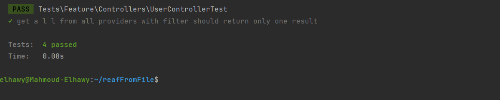
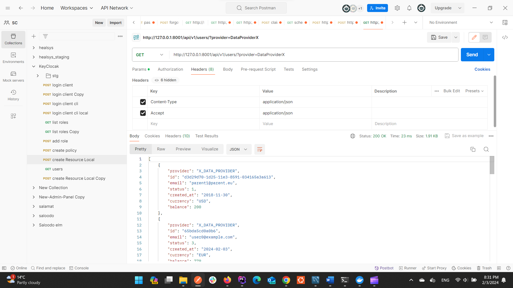
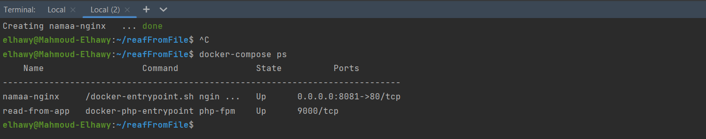
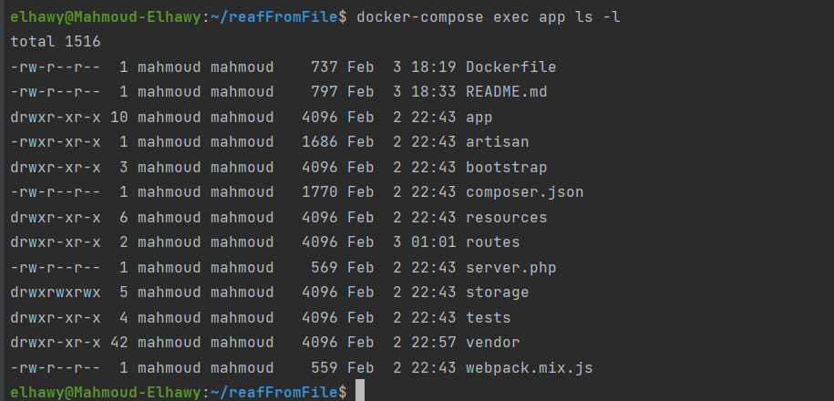
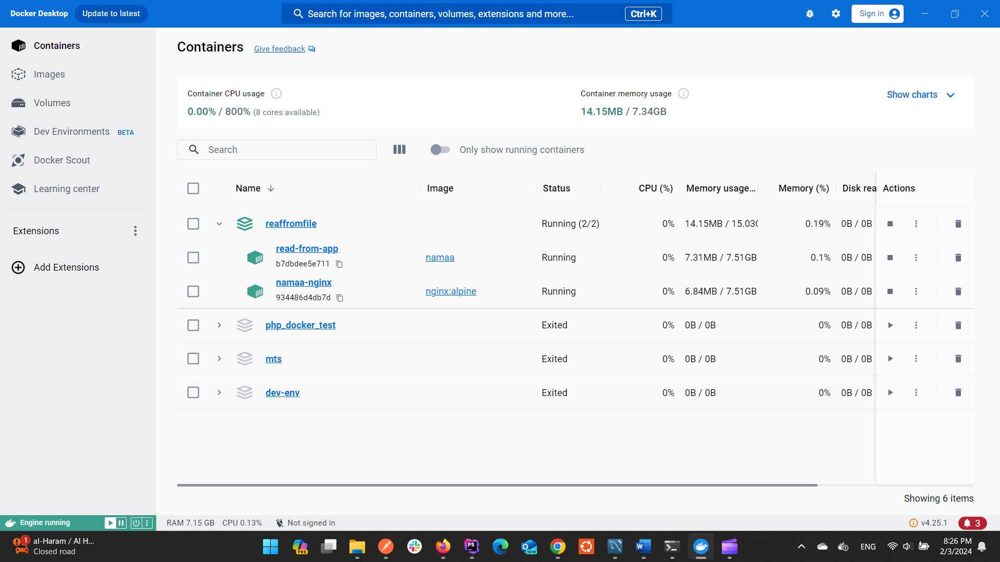
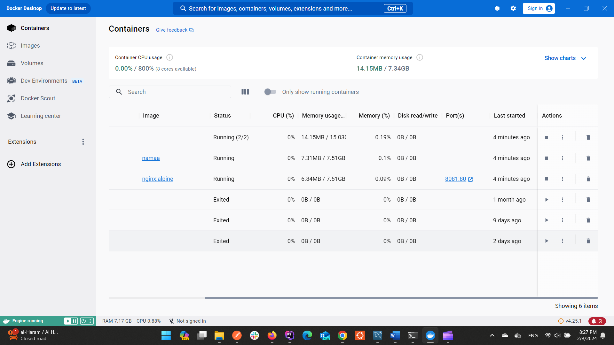
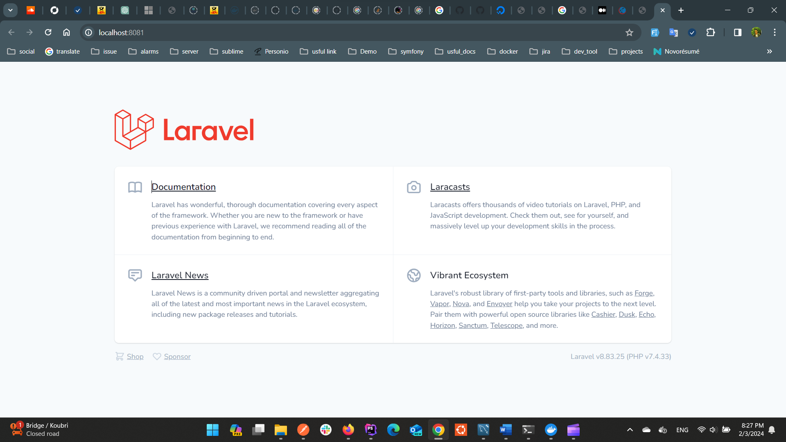

## Challenge Idea
We have two providers collect data from them two main providers to get products that contain offers  in json files we need to read and make some filter operations on them to get the result

You can check the json files inside jsons folder 

- `DataProviderX` data is stored in [DataProviderX.json]
- `DataProviderY` data is stored in [DataProviderY.json]

`clone the project`

`cd to reafFromFile`

`run cp .env.example .env`

`run composer install`

# #Run test to make sure app work fine
     php artisan test

## hit the endpoint with the required filters
`run php artisan serve --port 8001` to avoid any conflict with local port

#Using Docker

    docker-compose up -d --build
    docker-compose ps

 then make sure user have correct permission 

    install composer

    docker-compose exec app php artisan key:generate

